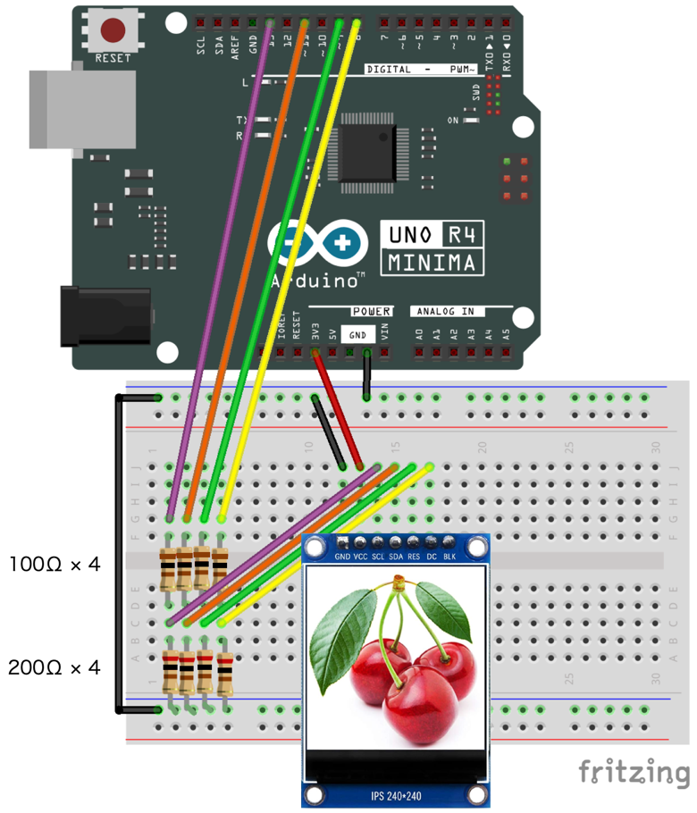

# Jpeg images in Flash memory

This sketch shows jpeg images on Flash memory using [Bodmer/TJpg_Decoder](https://github.com/Bodmer/TJpg_Decoder "Bodmer/TJpg_Decoder: Jpeg decoder library based on Tiny JPEG Decompressor")

## Wiring diagram



## How to store jpeg data into flash memory

1. Install [the latest version of TJpg_Decoder](https://github.com/Bodmer/TJpg_Decoder/releases "Releases · Bodmer/TJpg_Decoder") in the Arduino IDE library.

2. Prepare a JPEG image that matche the resolution of your LCD display.

3. Visit [File to hex converter](http://tomeko.net/online_tools/file_to_hex.php?lang=en "File to hex converter") to convert jpeg image into hexadecimal text data.

4. Create a new header file and paste hexadecimal text data as follows:

```c++
const uint8_t name_of_image[] PROGMEM = {
  0xFF, 0xD8, 0xFF, 0xE0, 0x00, 0x10, 0x4A, 0x46, 0x49, 0x46, 0x00, 0x01, 0x01, 0x00, 0x00, 0x48, 
  ...
};
```

5. Include the created header file in [`Flash_Jpg_GFX.ino`](Flash_Jpg_GFX.ino).

```c++
#include "name_of_image.h"
...
```

6. Add code to render to the LCD.

```c++
void loop() {
  drawImage(name_of_image, sizeof(name_of_image));
  delay(3000);
}
```


