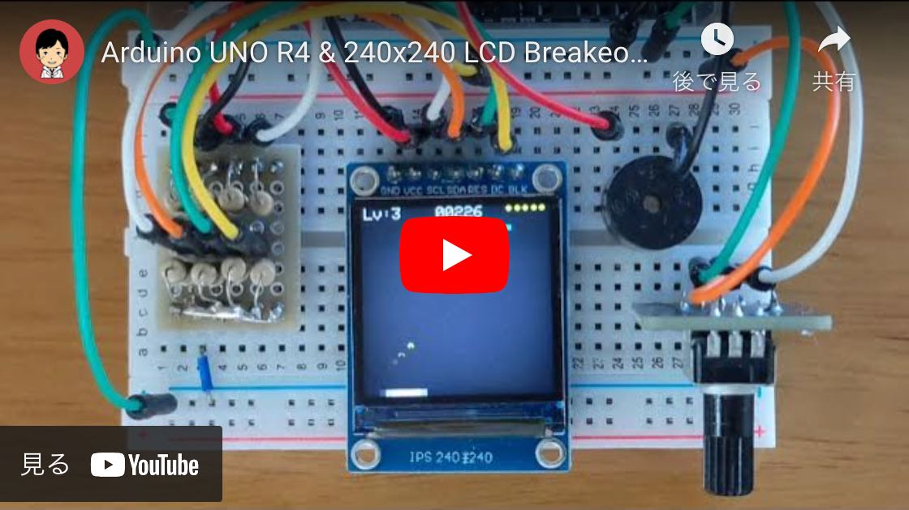

# Breakout game

## Dependencies

- [adafruit/Adafruit-GFX-Library](https://github.com/adafruit/Adafruit-GFX-Library "adafruit/Adafruit-GFX-Library: Adafruit GFX graphics core Arduino library, this is the &#39;core&#39; class that all our other graphics libraries derive from")
- [Adafruit ST7735 and ST7789 Library](https://www.arduino.cc/reference/en/libraries/adafruit-st7735-and-st7789-library/ "Adafruit ST7735 and ST7789 Library - Arduino Reference")

## Wiring diagram

### Pin Assignments

SPI pin definition for Arduino UNO R3 and R4

  | ST7798 | PIN  |  R3  |   R4   |     Description      |
  |--------|------|------|--------|----------------------|
  | SCL    |  D13 | SCK  | RSPCKA | Serial clock         |
  | SDA    | ~D11 | COPI | COPIA  | Serial data input    |
  | RES    | ~D9  | PB1  | P303   | Reset signal         |
  | DC     |  D8  | PB0  | P304   | Display data/command |

#### Pinout

- [Arduino UNO R4 Minima](https://docs.arduino.cc/resources/pinouts/ABX00080-full-pinout.pdf) (PDF)
- [Arduino UNO R4 WiFi](https://docs.arduino.cc/resources/pinouts/ABX00087-full-pinout.pdf) (PDF)
- [Arduino UNO R3](https://docs.arduino.cc/resources/pinouts/A000066-full-pinout.pdf) (PDF)

## Acknowledgement

This program was written with reference to the following articles:

- [Arduino（４）　ブロック崩しを作ってみる（１）](https://blog.boochow.com/article/423049468.html "Arduino（４）　ブロック崩しを作ってみる（１）  &#8211;  楽しくやろう。")
- [Arduino（５）　ブロック崩しを作ってみる（２）](https://blog.boochow.com/article/423178933.html "Arduino（５）　ブロック崩しを作ってみる（２）  &#8211;  楽しくやろう。")
- [Arduino（６）　ブロック崩しを作ってみる（３）](https://blog.boochow.com/article/423481451.html "Arduino（６）　ブロック崩しを作ってみる（３）  &#8211;  楽しくやろう。")
