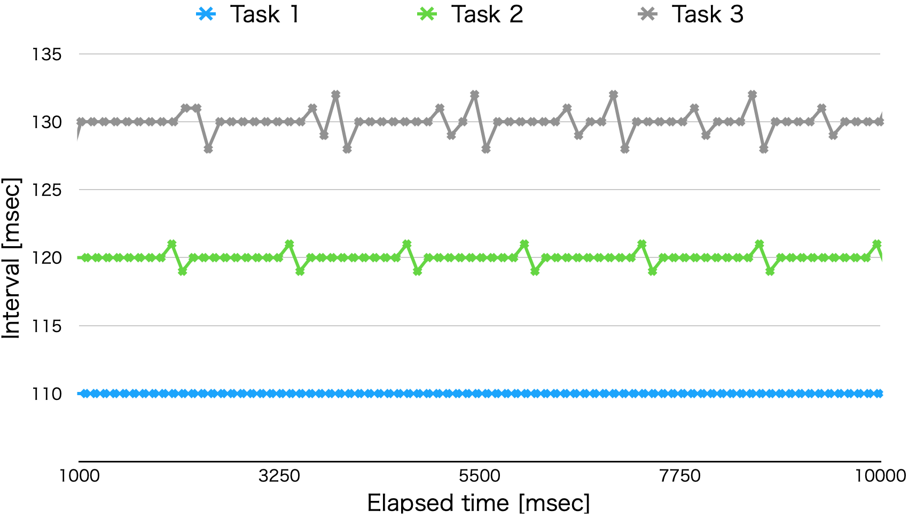
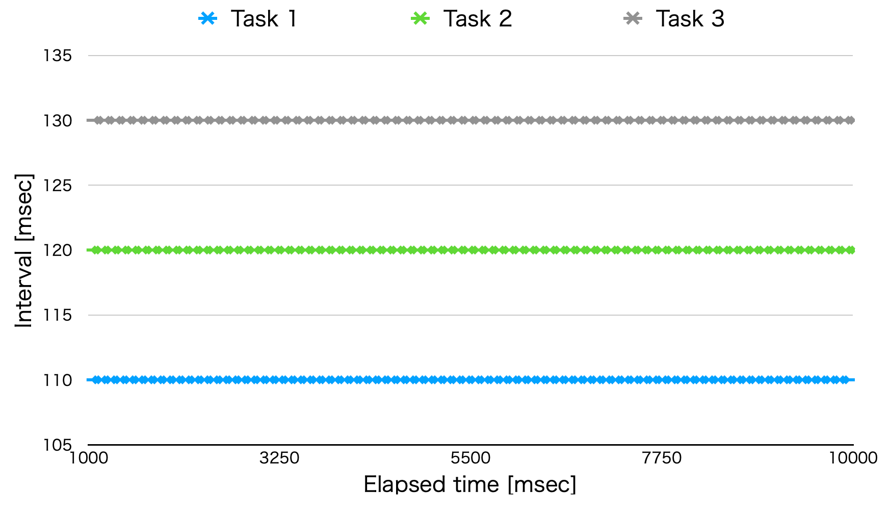

# Non-preemptive multitasking

This program checks the effect on the periodicity of each task depending on the location where the base time is measured by millis().

## Sketch similar to "Blink without delay" that launches three tasks

```c++
#define INTERVAL1 110 // [msec]
#define INTERVAL2 120 // [msec]
#define INTERVAL3 130 // [msec]

uint32_t previousMillis1 = 0;
uint32_t previousMillis2 = 0;
uint32_t previousMillis3 = 0;

void ExecTask(uint32_t ms) {
  delay(ms); // Pseudo processing time
}

void setup() {}

void loop() {
  uint32_t currentMillis = millis();

  // Task 1
  if (currentMillis - previousMillis1 >= INTERVAL1) {
    previousMillis1 = currentMillis;
    ExecTask(1);
  }

  // Task 2
  if (currentMillis - previousMillis2 >= INTERVAL2) {
    previousMillis2 = currentMillis;
    ExecTask(2);
  }

  // Task 3
  if (currentMillis - previousMillis3 >= INTERVAL3) {
    previousMillis3 = currentMillis;
    ExecTask(3);
  }
}
```

- Reference: [Now for two at once | Multi-tasking the Arduino - Part 1](https://learn.adafruit.com/multi-tasking-the-arduino-part-1/now-for-two-at-once "Now for two at once | Multi-tasking the Arduino - Part 1 | Adafruit Learning System")

### The interval at which each task is launched



## Revised sketch

```c++
#define INTERVAL1 110 // [msec]
#define INTERVAL2 120 // [msec]
#define INTERVAL3 130 // [msec]

uint32_t previousMillis1 = 0;
uint32_t previousMillis2 = 0;
uint32_t previousMillis3 = 0;

void loop() {
  uint32_t currentMillis;

  // Task 1
  if ((currentMillis = millis()) - previousMillis1 >= INTERVAL1) {
    previousMillis1 = currentMillis;
    ExecTask(1);
  }

  // Task 2
  if ((currentMillis = millis()) - previousMillis2 >= INTERVAL2) {
    previousMillis2 = currentMillis;
    ExecTask(2);
  }

  // Task 3
  if ((currentMillis = millis()) - previousMillis3 >= INTERVAL3) {
    previousMillis3 = currentMillis;
    ExecTask(3);
  }
}
```

### The interval at which each task is launched (revised)


